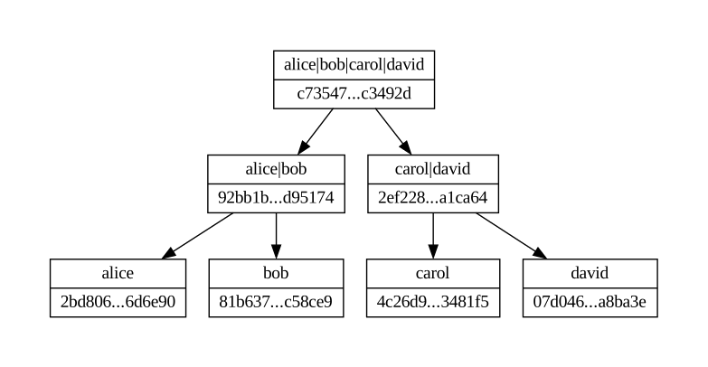

## What exactly is Merkle Tree?

**Merkle Tree** is a special type of tree structure, where every node is a hash of concatenated values of its child nodes. In practice, this structure is build from the bottom to the top and requires some kind of plaintext input list.

## What does Merkle Tree look like?

Merkle Tree can look somehow like this:



Each level (except leaves) requires at least one child node to generated the hash of concatenated values of the childs. This simple graph contains both hash values and labels, but in practice hashes are generated from concatenated **hashes** of childs nodes (top node hash is generated from inputing **92bb1b...d95174||2ef228...a1ca64** into hashing function).

## What it is used for?

Merkle Tree is very useful structure utilized in cryptography, compressing algorithms, peer-to-peer-networks or even in blockchain implementations.

## What is Inclusion Proof?

Merkle Tree allows us to check does given element can be trusted or not. Simply said, **Inclusion Proof** give us information, whether a hash of the given element exist into the Merkle Tree structure.

```
>>> from merkle_tree import *
>>> from tests.inclusion_proof import check_inclusion
>>> tree = MerkleTree(['a','b','c','d','e'])
>>> check_inclusion(tree, 'c')
True
>>> check_inclusion(tree, 'g')
False
```

## What is Consistency Proof?

Consistency Proof is a simple test that allows us to verify the consistency of two trees (e.g. before and after adding some records to the tree). Consistency check is successful when two criteria are met:

- Does main tree fully contain subtree? (if main tree had the same amount of records as subtree, would its root hash be the same as subtree root hash?)

- If subtree was merged with the rest of main tree, would it give the same root hash as main tree root hash?

```
>>> from merkle_tree import *
>>> from tests.consistency_proof import check_consistency
>>> tree = MerkleTree(['a','b','c','d','e', '1', '2', '3'])
>>> correct_subtree = MerkleTree(['a','b','c','d','e','1'])
>>> check_consistency(correct_subtree, tree)
True
>>> incorrect_subtree = MerkleTree(['a','b','c','d','1','2','3'])
>>> check_consistency(incorrect_subtree, tree)
False
```
